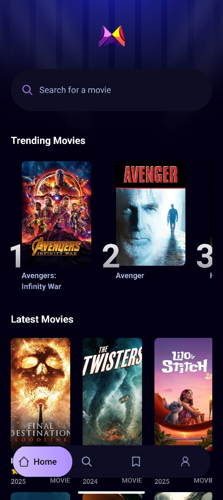
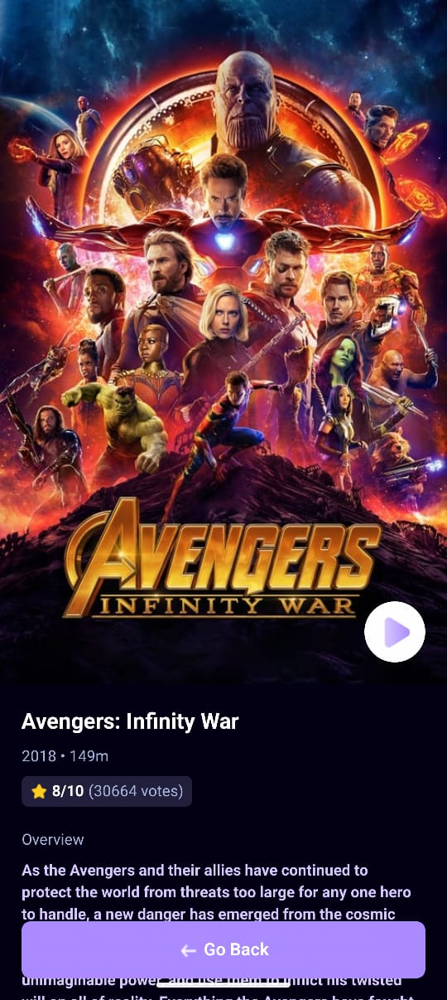
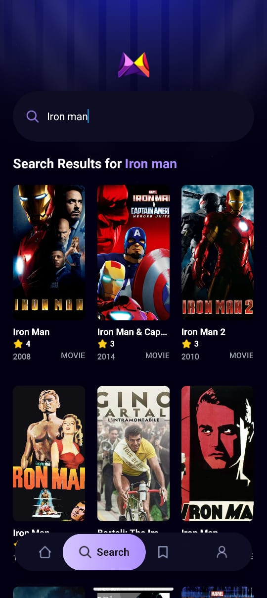

# 🎬 MovieZone

**MovieZone** is a sleek and modern React Native application that displays detailed information about movies. It pulls trending and popular movie data from a public movie API and presents it in an engaging, user-friendly interface.

<br/>

## 📱 Screenshots

<div align="center">
  
  
  
</div>

<br/>

## 🚀 Features

- 🔍 Browse trending and top-rated movies
- 🎞️ View detailed information about each movie
- 🌐 Fetches real-time data using The Movie Database (TMDB) API
- 📱 Clean and responsive UI with React Native
- ⚡ Fast and lightweight

<br/>

## 🛠️ Tech Stack

- React Native (Expo)
- TypeScript
- Fetch API
- TMDB API

<br/>

## ⚙️ Installation

1. **Clone the repository:**
   ```bash
   git clone https://github.com/ZisanSarker/moviezone-rn.git
   cd moviezone-rn
   ```

2. **Install dependencies:**
   ```bash
   npm install
   ```

3. **Create a `.env` file in the root directory:**
      ```env
   EXPO_PUBLIC_MOVIE_API_KEY=your_tmdb_api_key_here
   EXPO_PUBLIC_APPWRITE_PROJECT_ID=your_appwrite_project_id
   EXPO_PUBLIC_APPWRITE_ENDPOINT=your_appwrite_endpoint_url
   EXPO_PUBLIC_APPWRITE_DATABASE_ID=your_database_id
   EXPO_PUBLIC_APPWRITE_COLLECTION_ID=your_collection_id
   ```

4. **Run the application:**
   ```bash
   npx expo start
   ```

<br/>

## 🧠 How It Works

- The app fetches data from TMDB using an API key stored in a `.env` file.
- Data is displayed using custom movie card components.
- Navigation and UI are managed using React Native components and hooks.

<br/>

## 📁 Folder Structure

```
MovieZone/
├── app/
│   ├── (tabs)/
│   │   ├── index.tsx
│   │   ├── _layout.tsx
│   │   ├── search.tsx
│   │   ├── save.tsx
│   │   └── profile.tsx
│   └── movie/
│       ├── _layout.tsx
│       └── [id].tsx
│
├── assets/
│   ├── fonts/
│   ├── icons/
│   ├── images/
│   └── screenshots/
│       ├── screenshot1.jpeg
│       ├── screenshot2.jpeg
│       └── screenshot3.jpeg
│
├── components/
├── constants/
├── interfaces/
├── services/
├── types/
├── .env
└── App.js
```

<br/>

## 🧑‍💻 Author

**Zisan Sarker**  
[GitHub Profile](https://github.com/ZisanSarker)

<br/>

## 📝 License

This project is licensed under the MIT License.

---

> If you like the project, consider giving it a ⭐️ on GitHub!

